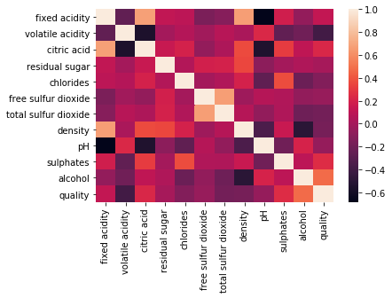

# WineQualityTesting

A dataset is taken which is saved as ```winequality-red.csv```. First step is to import the necessary libraries like pandas, sklearn, numpy, etc. After this the dataset is read using read_csv and subsequently the feature extraction takes place.
Visualization of featues is done using the heatmap.

- Working:
After extracting the features, their impact on each other is described through heatmap. The darker colours show high impact and lighter ones show least impact.You will probably need to normalise your matrix, choose a relevant colour palette, use cluster analysis and thus permute the rows and the columns of the matrix to place similar values near each other according to the clustering.

- Understanding heatmap:
Each square shows the correlation between the variables on each axis. Correlation ranges from -1 to +1. Values closer to zero means there is no linear trend between the two variables. The close to 1 the correlation is the more positively correlated they are; that is as one increases so does the other and the closer to 1 the stronger this relationship is. A correlation closer to -1 is similar, but instead of both increasing one variable will decrease as the other increases. The diagonals are all 1/dark green because those squares are correlating each variable to itself (so it's a perfect correlation). For the rest the larger the number and darker the color the higher the correlation between the two variables. The plot is also symmetrical about the diagonal since the same two variables are being paired together in those squares.





 ### Features taken into consideration:
- fixed acidity : sort most acids involved with wine or fixed or nonvolatile (do not evaporate readily)
- volatile acidity: sort the amount of acetic acid in wine, which at too high of levels can lead to an unpleasant, vinegar taste
- citric acid: sort found in small quantities, citric acid can add 'freshness' and flavor to wines
- residual sugar: sort the amount of sugar remaining after fermentation stops, it's rare to find wines with less than 1 gram/liter and wines with greater than 45 grams/liter are considered sweet
- chlorides: sort the amount of salt in the wine
- free sulfur dioxide: sort the free form of SO2 exists in equilibrium between molecular SO2 (as a dissolved gas) and bisulfite ion; it prevents microbial growth and the oxidation of wine
- total sulfur dioxide: sort amount of free and bound forms of S02; in low concentrations, SO2 is mostly undetectable in wine, but at free SO2 concentrations over 50 ppm, SO2 becomes evident in the nose and taste of wine
- density: sort the density of water is close to that of water depending on the percent alcohol and sugar content
- pH: sort describes how acidic or basic a wine is on a scale from 0 (very acidic) to 14 (very basic); most wines are between 3-4 on the pH scale
- sulphates: sort a wine additive which can contribute to sulfur dioxide gas (S02) levels, wich acts as an antimicrobial.

### Additional features that can be added

What might be an interesting thing to do, is aside from using regression modelling, is to set an arbitrary cutoff for your dependent variable (wine quality) at e.g. 7 or higher getting classified as 'good/1' and the remainder as 'not good/0'.
This allows you to practice with hyper parameter tuning on e.g. decision tree algorithms looking at the ROC curve and the AUC value.
Without doing any kind of feature engineering or overfitting you should be able to get an AUC of .88 (without even using random forest algorithm)

## Inspiration
Use machine learning to determine which physiochemical properties make a wine 'good'


## Dependencies

- Python 3.6
- Anaconda
- NumPy
- Scikit-learn
- Matplotlib

## 📦 Install

Open the code ```testing.py``` in Anaconda(Spyder environment) after downloading Anaconda and launchingSpyder environment for windows to simply run it. Before this save the csv files in a folder so that you can fetch it by putting the location of saved file in the code.

Similarly use any other environment according to your preference and run the code line by line by pressing ```Ctrl+Enter```, with single or multiple selections.

